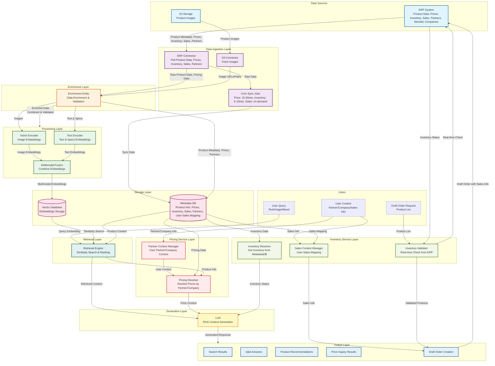

# Multimodal RAG System Design - Sản phẩm Gạch

## Tổng quan

Hệ thống RAG (Retrieval Augmented Generation) multimodal cho sản phẩm gạch, hỗ trợ tìm kiếm, hỏi đáp và gợi ý sản phẩm dựa trên hình ảnh, mô tả văn bản và thông số kỹ thuật.

## Kiến trúc hệ thống

## Chi tiết các thành phần

### 1. Data Sources
- **ERP System**: Chứa dữ liệu sản phẩm (metadata, thông số kỹ thuật, mô tả), bảng giá sản phẩm theo đối tác, bảng giá sản phẩm theo công ty thành viên, thông tin đối tác và công ty thành viên, inventory data, và sales data (bao gồm thông tin sales và user-sales mapping)
- **S3 Storage**: Lưu trữ hình ảnh sản phẩm

### 2. Data Ingestion Layer
- **ERP Connector**: Pull dữ liệu sản phẩm, bảng giá theo đối tác/công ty thành viên, thông tin đối tác và công ty thành viên, inventory data, và sales data từ ERP system
- **S3 Connector**: Fetch hình ảnh sản phẩm từ S3 storage
- **Cron Sync Jobs**: 
  - **Price Sync**: Đồng bộ bảng giá từ ERP → MetadataDB định kỳ mỗi 15-30 phút
  - **Inventory Sync**: Đồng bộ inventory từ ERP → MetadataDB định kỳ mỗi 5-10 phút (dùng cho hiển thị)
  - **Sales Sync**: Đồng bộ sales data và user-sales mapping từ ERP → MetadataDB (có thể sync định kỳ hoặc on-demand)

### 3. Enrichment Layer
- **Enrichment Entity**: 
  - Kết hợp dữ liệu từ ERP (sản phẩm, giá, đối tác, công ty thành viên) và S3
  - Bổ sung metadata, tags, categories
  - Chuẩn hóa và validate dữ liệu
  - Tạo enriched product entities

### 4. Processing Layer
- **Vision Encoder**: Chuyển đổi hình ảnh thành embeddings (CLIP, ViT, etc.)
- **Text Encoder**: Chuyển đổi văn bản và thông số kỹ thuật thành embeddings
- **Multimodal Fusion**: Kết hợp embeddings từ nhiều modalities thành unified representation
  - **Fusion Strategy**: 
    - **Concatenation + Projection**: Nối embeddings từ vision và text, sau đó project về cùng dimension (ví dụ: 768D)
    - **Weighted Fusion**: Kết hợp với trọng số có thể học được (vision: 0.6, text: 0.4) hoặc cố định
    - **Cross-Modal Attention**: Sử dụng attention mechanism để align và fuse embeddings
  - **Normalization**: L2 normalization sau fusion để đảm bảo embeddings có cùng scale
  - **Dimension Handling**: 
    - Vision embeddings: 512D (CLIP) hoặc 768D (ViT)
    - Text embeddings: 768D (BERT) hoặc 512D (CLIP text encoder)
    - Unified embedding: 768D hoặc 1024D (sau fusion)
  - **Query Handling**:
    - **Text-only query**: Chỉ encode text, không cần fusion (hoặc fusion với zero-padded vision embedding)
    - **Image-only query**: Chỉ encode image, không cần fusion (hoặc fusion với zero-padded text embedding)
    - **Mixed query**: Encode cả text và image, sau đó fusion
  - **Implementation Options**:
    - **Simple Concatenation**: `[vision_emb; text_emb]` → Linear projection
    - **CLIP-style**: Sử dụng CLIP model đã được train sẵn cho multimodal fusion
    - **Custom Fusion Network**: MLP hoặc Transformer-based fusion layer

### 5. Storage Layer
- **Vector Database**: Lưu trữ embeddings để tìm kiếm similarity (Pinecone, Weaviate, Qdrant, etc.)
- **Metadata DB**: Lưu trữ:
  - Thông tin sản phẩm gốc
  - Bảng giá sản phẩm theo đối tác và công ty thành viên (sync từ ERP)
  - Inventory data (sync từ ERP, dùng cho hiển thị)
  - Sales data (sync từ ERP)
  - User → Sales mapping table
  - Thông tin đối tác và công ty thành viên
  - Sales info trong draft orders
  (PostgreSQL, MongoDB, etc.)

### 6. Retrieval Layer
- **Retrieval Engine**: 
  - **Query Processing**: 
    - Nhận query từ user (text, image, hoặc mixed)
    - Encode query qua cùng pipeline như indexing (Vision Encoder + Text Encoder + Multimodal Fusion)
    - Đảm bảo query embedding có cùng format và dimension với stored embeddings
  - **Similarity Search**: 
    - Tìm kiếm similarity trong vector database (cosine similarity, dot product, etc.)
    - Hỗ trợ hybrid search (vector + metadata filtering)
  - **Ranking và Filtering**: 
    - Ranking kết quả theo similarity score
    - Filtering theo metadata (category, price range, availability, etc.)
  - **Context Building**: 
    - Kết hợp retrieved embeddings với metadata để tạo context
    - Bao gồm product info, pricing, inventory status

### 7. Pricing Service Layer
- **Pricing Resolver**: 
  - Xác định đối tác/công ty thành viên của user từ user context
  - Truy vấn giá tương ứng từ Metadata DB
  - Áp dụng các quy tắc giá (discount, tier pricing, etc.)
  - Trả về giá đã được cá nhân hóa theo đối tác/công ty thành viên
- **Partner Context Manager**: 
  - Quản lý context về đối tác/công ty thành viên của user
  - Xác thực quyền truy cập giá theo đối tác
  - Mapping user → partner/company

### 7.1. Inventory Service Layer
- **Inventory Resolver**: 
  - Lấy inventory từ MetadataDB cho hiển thị trong search results, Q&A, recommendations
  - Dữ liệu được sync định kỳ từ ERP (5-10 phút)
- **Inventory Validator**: 
  - Real-time check inventory từ ERP khi user tạo đơn nháp
  - Validate inventory trước khi tạo đơn để đảm bảo sản phẩm còn hàng
  - Tránh tạo đơn cho sản phẩm đã hết hàng
- **Sales Context Manager**: 
  - Quản lý thông tin sales/user tạo đơn nháp
  - Mapping user → sales từ MetadataDB (đã sync từ ERP)
  - Lấy sales info từ MetadataDB khi tạo đơn nháp
  - Đảm bảo đơn nháp có thông tin sales chính xác

### 8. Draft Order Creation Flow
- **Flow tạo đơn nháp**:
  1. User yêu cầu tạo đơn nháp với danh sách sản phẩm
  2. **Inventory Validator** thực hiện real-time check inventory từ ERP cho từng sản phẩm
  3. **Sales Context Manager** lấy thông tin sales từ user context → sales mapping trong MetadataDB
  4. Validate inventory: Nếu sản phẩm hết hàng → thông báo lỗi, không tạo đơn
  5. Nếu tất cả sản phẩm còn hàng → tạo đơn nháp với:
     - Danh sách sản phẩm và số lượng
     - Thông tin sales (lấy từ user context)
     - Thông tin partner/company của user
  6. Gửi đơn nháp về ERP system với đầy đủ thông tin (sản phẩm, sales, partner/company)
- **Integration với ERP**: Đơn nháp được tạo trực tiếp trong ERP system, đảm bảo dữ liệu đồng bộ

### 9. Generation Layer
- **LLM**: Nhận retrieved context và generate response (GPT-4, Claude, Llama, etc.)

### 10. Output Layer
- **Search Results**: Kết quả tìm kiếm sản phẩm
- **Q&A Answers**: Câu trả lời cho câu hỏi về sản phẩm
- **Product Recommendations**: Gợi ý sản phẩm tương tự
- **Price Inquiry Results**: Kết quả hỏi giá sản phẩm theo đối tác/công ty thành viên

## Use Cases

1. **Tìm kiếm sản phẩm**: User có thể tìm kiếm bằng text, hình ảnh, hoặc kết hợp
2. **Hỏi đáp**: User đặt câu hỏi về sản phẩm, hệ thống trả lời dựa trên RAG context
3. **Gợi ý sản phẩm**: Hệ thống gợi ý sản phẩm tương tự dựa trên sản phẩm hiện tại
4. **Hỏi giá sản phẩm**: User hỏi giá sản phẩm, hệ thống trả về giá theo đối tác/công ty thành viên của user
   - Hỗ trợ hỏi giá theo đối tác cụ thể
   - Hỗ trợ hỏi giá theo công ty thành viên
   - Hỗ trợ so sánh giá giữa các đối tác/công ty thành viên
5. **Tạo đơn nháp**: User có thể tạo đơn nháp về ERP system
   - Hệ thống hiển thị inventory từ MetadataDB (sync định kỳ)
   - Khi tạo đơn nháp, hệ thống thực hiện real-time inventory validation từ ERP
   - Hệ thống tự động lấy thông tin sales từ user context → sales mapping
   - Đơn nháp được tạo trong ERP với đầy đủ thông tin: sản phẩm, số lượng, sales, partner/company
   - Nếu sản phẩm hết hàng, hệ thống thông báo và không tạo đơn

## Data Flow

### Data Ingestion & Sync Flow
1. **Ingestion**: Pull dữ liệu từ ERP (bao gồm sản phẩm, giá, đối tác, công ty thành viên, inventory, sales data) và fetch images từ S3
2. **Cron Sync Jobs**: 
   - Price sync: Định kỳ 15-30 phút từ ERP → MetadataDB
   - Inventory sync: Định kỳ 5-10 phút từ ERP → MetadataDB (dùng cho hiển thị)
   - Sales sync: Định kỳ hoặc on-demand từ ERP → MetadataDB (sales data và user-sales mapping)
3. **Enrichment**: Kết hợp và làm giàu dữ liệu
4. **Processing**: Encode thành embeddings (vision + text)
5. **Storage**: Lưu embeddings vào vector DB và metadata (bao gồm pricing, inventory, sales data) vào DB

### Retrieval Flow
6. **Query Processing**: 
   - User query (text/image/mixed) → Vision Encoder (nếu có image) + Text Encoder (nếu có text)
   - Multimodal Fusion: Kết hợp query embeddings thành unified query embedding
   - Đảm bảo query embedding có cùng format và dimension với stored embeddings
7. **Retrieval**: Query embedding → similarity search trong vector database → retrieve relevant context
8. **Pricing Resolution**: Xác định đối tác/công ty thành viên của user → truy vấn giá tương ứng từ Metadata DB
9. **Inventory Display**: Lấy inventory từ MetadataDB (đã sync) để hiển thị trong kết quả
10. **Generation**: LLM generate response với retrieved context, pricing information, và inventory status
11. **Output**: Trả về kết quả cho user (bao gồm giá theo đối tác/công ty thành viên và inventory status)

### Draft Order Creation Flow
11. **User Request**: User yêu cầu tạo đơn nháp với danh sách sản phẩm
12. **Sales Context Resolution**: Sales Context Manager lấy thông tin sales từ user context → sales mapping trong MetadataDB
13. **Real-time Inventory Validation**: Inventory Validator thực hiện real-time check inventory từ ERP cho từng sản phẩm
14. **Validation**: Nếu sản phẩm hết hàng → thông báo lỗi, không tạo đơn
15. **Draft Order Creation**: Nếu tất cả sản phẩm còn hàng → tạo đơn nháp với đầy đủ thông tin (sản phẩm, sales, partner/company)
16. **ERP Integration**: Gửi đơn nháp về ERP system

## Data Sync Strategy

Hệ thống sử dụng chiến lược sync đơn giản để đảm bảo hiệu năng và độ chính xác:

### Price Data
- **Strategy**: Sync định kỳ 15-30 phút từ ERP → MetadataDB
- **Lý do**: 
  - Price không thay đổi liên tục, delay 15-30 phút là chấp nhận được
  - Đảm bảo retrieval nhanh, không phụ thuộc ERP
  - Đơn giản, dễ maintain
- **Usage**: Pricing Resolver đọc trực tiếp từ MetadataDB khi retrieval

### Inventory Data
- **Strategy**: Hybrid approach đơn giản
  - **Hiển thị**: Sync định kỳ 5-10 phút từ ERP → MetadataDB (dùng cho search results, Q&A, recommendations)
  - **Tạo đơn nháp**: Real-time check từ ERP khi user tạo đơn (đảm bảo chính xác)
- **Lý do**:
  - Inventory thay đổi thường xuyên hơn price
  - Cần chính xác khi tạo đơn, nhưng có thể chấp nhận delay nhỏ cho hiển thị
  - Không làm chậm retrieval flow (dùng cached data)
- **Usage**: 
  - Inventory Resolver đọc từ MetadataDB cho hiển thị
  - Inventory Validator check real-time từ ERP khi tạo đơn nháp

### Sales Data
- **Strategy**: Sync từ ERP → MetadataDB (có thể sync định kỳ hoặc on-demand)
- **Lý do**:
  - Sales data và user-sales mapping không thay đổi thường xuyên
  - Cần có sẵn trong MetadataDB để mapping nhanh khi tạo đơn nháp
- **Usage**: 
  - Sales Context Manager đọc từ MetadataDB khi cần mapping user → sales
  - Được sử dụng khi tạo đơn nháp để gắn sales info vào đơn

### Tổng kết
- **Approach đơn giản**: Không sử dụng event-driven hay webhook phức tạp
- **Hiệu năng**: Retrieval flow nhanh nhờ cached data trong MetadataDB
- **Chính xác**: Real-time check khi cần thiết (tạo đơn nháp)
- **Maintainability**: Dễ maintain và debug với cron jobs đơn giản

